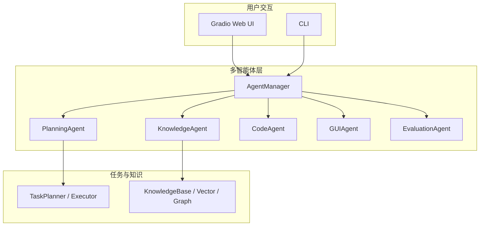

# 🤖 Manus AI 代理系统 - 工业级设计方案

[](https://www.python.org)
[](LICENSE)
[](https://www.docker.com)

## 项目名称与一句话

**Manus AI 代理系统** — 面向桌面场景的工业级多智能体框架，集成任务规划、**多源知识检索（向量 / 关键词 / 图谱）**、GUI 自动化与可观测能力。

## 版本演进（对齐课程 V1–V4）

| 目录 | 说明 |
|------|------|
| [v1-skeleton](v1-skeleton/) | 骨架：`BaseAgent` 抽象 + 最小 `EchoAgent` 可运行示例 |
| [v2-automation](v2-automation/) | 自动化：本地 `pytest` + `output/run_summary.txt` 摘要 |
| [v3-multi-agent](v3-multi-agent/) | 多智能体：`AgentManager` + `MessageBus` 演示脚本 |
| [v4-production](v4-production/) | 生产化：CI、Docker、Telegram / 成本日志脚本说明 |

**完整业务代码**位于仓库根目录 [`src/`](src/)（非重复拷贝）；上表为渐进交付边界说明。

## 架构图（Mermaid）



## 快速开始（最小路径）

```bash
git clone https://github.com/173787247/manus-ai-system.git
cd manus-ai-system

# 依赖安装（国内可用清华 PyPI 镜像加速「拉包」）
pip install -r requirements.txt \
  -i https://pypi.tuna.tsinghua.edu.cn/simple \
  --trusted-host pypi.tuna.tsinghua.edu.cn

# 或先全局指定镜像（之后直接 pip install 即可）
# pip config set global.index-url https://pypi.tuna.tsinghua.edu.cn/simple
# pip config set global.trusted-host pypi.tuna.tsinghua.edu.cn

copy .env.example .env   # Windows；Linux/Mac: cp .env.example .env
# 编辑 .env 填入 OPENAI_API_KEY（可选；无 Key 时部分能力走规则/模拟）

# Web 演示
python main.py
# 或交互选择 CLI/Web
python run_demo.py
```

**与 CI 一致的轻量依赖**（同样需要镜像时，命令相同，把 `requirements.txt` 换成 `requirements-ci.txt`）：

```bash
pip install -r requirements-ci.txt \
  -i https://pypi.tuna.tsinghua.edu.cn/simple \
  --trusted-host pypi.tuna.tsinghua.edu.cn
pytest tests/ -v
```

**V2 脚本使用镜像**：在安装前设置环境变量即可（见 `v2-automation/README.md`）。

**运行截图**：三张提交用 PNG 已置于 [`docs/screenshots/`](docs/screenshots/)（CI / Telegram / 成本汇总），详见该目录说明。

---

## 📋 项目概述（详细）

Manus AI 是一个工业级的多智能体代理系统，结合了 GUI-Agent 的视觉操作能力、多智能体协作、知识检索、任务规划与执行、自主学习等核心能力。系统能够像人类一样观察屏幕、理解任务、规划步骤并执行操作，构建完整的"感知-决策-行动"闭环。

## 🌟 核心特性

### 1. 多智能体协作系统
- **规划智能体 (Planning Agent)**: 任务分解与执行规划
- **知识检索智能体 (Knowledge Agent)**: 多源知识检索与融合
- **代码生成智能体 (Code Agent)**: 动态代码生成与执行
- **GUI操作智能体 (GUI Agent)**: 屏幕观察与界面操作
- **评估智能体 (Evaluation Agent)**: 任务完成度评估与反馈

### 2. GUI-Agent 核心能力
- **观察**: 实时屏幕截图捕获与视觉理解
- **思考**: 基于多模态大模型的任务推理
- **行动**: 通过 PyAutoGUI 执行鼠标键盘操作
- **循环**: 持续观察-决策-执行直到任务完成

### 3. 知识管理与检索
- **多源知识库**: 文档、知识图谱、代码库、历史经验
- **混合检索**: 向量检索 + 关键词检索 + 图谱查询
- **上下文工程**: 智能上下文选择与排序
- **知识更新**: 自动学习与知识库更新

### 4. 任务规划与执行
- **任务分解**: 复杂任务自动分解为子任务
- **执行规划**: 动态调整执行策略
- **错误恢复**: 智能错误检测与自动恢复
- **进度跟踪**: 实时任务进度监控

### 5. 自主学习与进化
- **经验积累**: 任务执行经验自动记录
- **策略优化**: 基于反馈的策略改进
- **知识更新**: 从执行中提取新知识
- **性能评估**: 持续的性能监控与优化

### 6. 透明性与可解释性
- **过程记录**: 完整的执行过程记录
- **可视化回放**: 任务执行过程可视化
- **决策解释**: 每一步决策的详细说明
- **日志追踪**: 完整的审计日志

## 🏗️ 系统架构（补充）

分层示意图见上文 **架构图（Mermaid）**；更细的模块说明见 [`docs/01-系统架构设计.md`](docs/01-系统架构设计.md)。

## 📁 项目结构

```
manus-ai-system/
├── README.md
├── requirements.txt
├── requirements-ci.txt              # CI / 轻量测试依赖
├── .env.example
├── .github/workflows/ci.yml         # GitHub Actions
├── main.py / run_demo.py            # 入口
├── v1-skeleton/                     # V1 骨架示例
├── v2-automation/                   # V2 自动化脚本与摘要输出
├── v3-multi-agent/                  # V3 多智能体演示
├── v4-production/                   # V4 生产化脚本（Telegram / 成本）
├── docs/
│   ├── screenshots/                 # 提交用运行截图（三张 PNG）
│   ├── sample_manus_cost.jsonl      # 成本汇总示例数据
│   ├── 01-系统架构设计.md
│   ├── 02-技术选型.md
│   ├── 03-智能体设计.md
│   ├── 04-知识与推理.md
│   ├── 05-自主学习与进化.md
│   ├── 06-部署与应用场景.md
│   └── 07-API文档.md（若存在）
├── docker-compose.yml
├── Dockerfile
├── src/
│   ├── agents/                      # 智能体模块
│   ├── core/
│   ├── gui/
│   ├── knowledge/
│   ├── learning/
│   ├── recording/
│   └── ui/
├── configs/
├── data/                            # 本地数据（默认不入库）
├── tests/
│   ├── test_agent_manager.py
│   ├── test_base_agent.py
│   ├── test_gui_agent.py
│   ├── test_integration.py
│   ├── test_knowledge_agent.py
│   ├── test_planning_agent.py
│   └── test_task_executor.py
└── scripts/
    ├── verify_graduation.ps1        # 提交前一键校验（Windows）
    ├── verify_graduation.sh         # 提交前一键校验（Unix）
    ├── run_tests.bat
    └── run_tests.sh
```

## 🚀 快速开始

### 环境要求

- Python 3.9+
- Docker Desktop（**可选**，仅在使用 `docker-compose` 部署时需要）
- NVIDIA GPU（**可选**；本地向量模型等若安装 CUDA 版 PyTorch 可利用显卡）

### 安装步骤

1. **克隆项目**
```bash
cd manus-ai-system
```

2. **安装依赖**（国内可使用清华 PyPI 镜像）
```bash
pip install -r requirements.txt \
  -i https://pypi.tuna.tsinghua.edu.cn/simple \
  --trusted-host pypi.tuna.tsinghua.edu.cn
```

3. **配置环境变量**
```bash
# Windows (PowerShell)
Copy-Item .env.example .env

# Linux/Mac
cp .env.example .env

# 编辑 .env 文件，填入您的 OpenAI API Key
# 详细配置说明请参考: API_CONFIG_GUIDE.md
```

4. **启动系统**
```bash
# 使用 Docker Compose
docker-compose up -d

# 或直接运行
python src/ui/web_ui.py
```

### Docker 部署

```bash
# 构建镜像
docker build -t manus-ai:latest .

# 运行容器
docker-compose up -d

# 查看日志
docker-compose logs -f
```

## 📖 使用示例

### 基本任务执行

```python
from src.core.agent_manager import AgentManager
from src.core.task_planner import TaskPlanner

# 初始化系统
manager = AgentManager()
planner = TaskPlanner(manager)

# 创建任务
task = {
    "instruction": "打开浏览器，搜索'AI Agent'，并截图保存",
    "evaluator": {
        "type": "screenshot_check",
        "expected": "包含搜索结果页面"
    }
}

# 执行任务
result = planner.execute_task(task)
print(f"任务状态: {result['status']}")
print(f"执行步骤: {result['steps']}")
```

### 多智能体协作

```python
# 规划智能体分解任务
plan = manager.planning_agent.decompose_task(task)

# 知识智能体检索相关信息
knowledge = manager.knowledge_agent.retrieve(plan['keywords'])

# GUI智能体执行操作
gui_result = manager.gui_agent.execute(plan['actions'])
```

## 🔧 配置说明

### API Key 配置（重要）

**首次使用必须配置：**
1. 复制 `.env.example` 为 `.env`
2. 在 `.env` 文件中填入您的 OpenAI API Key
3. 详细配置指南：[API_CONFIG_GUIDE.md](API_CONFIG_GUIDE.md)

**获取 OpenAI API Key：**
- 访问 [OpenAI Platform](https://platform.openai.com/api-keys)
- 注册/登录后创建新的 API Key
- 复制 Key 到 `.env` 文件中

**注意：** 即使没有 API Key，系统也可以运行，但功能会受限（使用规则方法作为备用）。

### 其他配置

详细配置说明请参考：
- [API配置指南](API_CONFIG_GUIDE.md) - **API Key配置必读**
- [系统架构设计](docs/01-系统架构设计.md)
- [技术选型](docs/02-技术选型.md)
- [智能体设计](docs/03-智能体设计.md)

## 📊 性能指标

- **任务完成率**: >85%
- **平均响应时间**: <3秒/步骤
- **知识检索准确率**: >90%
- **GUI操作成功率**: >95%

## 🤝 贡献指南

欢迎提交 Issue 和 Pull Request！

## 毕业设计提交自检（对照课程要求）

| 要求 | 说明 |
|------|------|
| V1–V4 目录 | 根目录 [`v1-skeleton/`](v1-skeleton/)～[`v4-production/`](v4-production/)，完整业务代码在 [`src/`](src/) |
| README | 上文含项目名称、一句话描述、Mermaid 架构图、快速开始 |
| 配置文件 | [`.env.example`](.env.example)、[`.gitignore`](.gitignore)、[`requirements.txt`](requirements.txt) |
| 运行截图 ≥3 | [`docs/screenshots/`](docs/screenshots/) 已含三张 PNG（CI / Telegram / 成本汇总），命名见该目录说明 |
| Git 历史 | 提交信息体现渐进开发（建议 ≥10 条）；推送前执行 `git log --oneline` 自检 |
| 一键本地校验 | 仓库根目录执行 `scripts/verify_graduation.ps1`（Windows）或 `bash scripts/verify_graduation.sh`（Linux/macOS） |

成本日志示例（可复制到 `logs/manus_cost.jsonl` 后运行 `python v4-production/scripts/cost_log_summary.py`）：[`docs/sample_manus_cost.jsonl`](docs/sample_manus_cost.jsonl)

**生成真实 `logs/manus_cost.jsonl`**：每次调用 LLM 后把 usage 记下来，在仓库根目录执行  
`python scripts/log_manus_cost.py --model <模型名> --prompt <输入token> --completion <输出token> --cost <美元>`  
（数字来自 API 返回的 `usage` 或 [OpenAI 用量页](https://platform.openai.com/usage) 估算。）

## 📄 许可证

MIT License

## 📞 联系方式

如有问题，请提交 Issue 或联系项目维护者。

